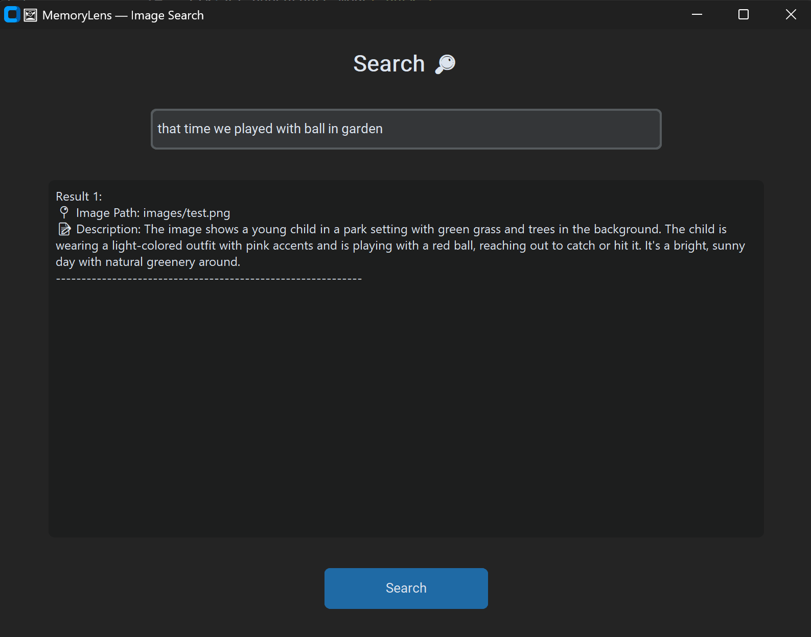

# memoryLens

**memoryLens** is a project that leverages OpenAI's API and Elasticsearch to analyze and index image content for efficient searching and retrieval. The application processes images, generates descriptive responses using OpenAI's API, and stores the results in an Elasticsearch index.



## Features

- **Image Analysis**: Automatically generates descriptions for images using OpenAI's API.
- **Search Functionality**: Enables full-text search with Elasticsearch for indexed image descriptions.
- **Bulk Indexing**: Supports bulk uploading of image data into Elasticsearch.

## Migration to OpenAI Responses API

The project has been updated to use the new OpenAI Responses API, replacing the older `ChatCompletion` format. This ensures compatibility with the latest OpenAI API standards.

For more details on the Responses API, refer to the [OpenAI documentation](https://community.openai.com/t/introducing-the-responses-api/1140929).

## Setup Instructions

> ⚠️ **Note:** This application **requires Elasticsearch to be installed and running** on your system. Make sure to have it set up before running the indexing or search scripts.

1. Clone the repository.
2. Install the required dependencies:
   ```bash
   pip install -r requirements.txt
   ```
3. Configure the `.env` file with your OpenAI API key and other necessary credentials.
4. Run the indexing script to process images and populate the Elasticsearch index:
   ```bash
   python indexing.py
   ```
5. Use the search script to query the indexed data:
   ```bash
   python searching.py
   ```

## Upcoming Features

- Implementing directory screenshot to track changes
- Enhanced error handling for API requests.
- Support for additional image formats.
- Improved search ranking and filtering options.

Thank you for using memoryLens!
